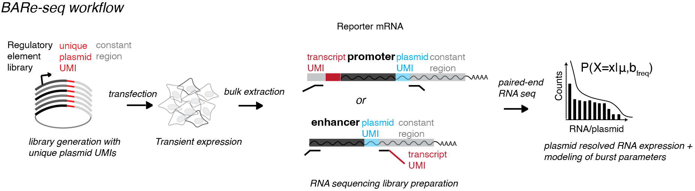

# BARe-seq

**BARe-seq** (Bulk Allele Resolution Sequencing) is an allele-resolved massively parallel reporter assay (MPRA) that enables inference of transcriptional burst parameters — burst size and burst frequency — from bulk sequencing data.

## Assay description

Transcriptional bursts determine RNA output through two kinetic parameters: burst size and burst frequency. How cis-regulatory DNA encodes these kinetic parameters remains unclear, in part because existing approaches do not combine scalable sequence perturbation with allele-resolved burst inference. Here, we developed Bulk Allele Resolution Sequencing (BARe-seq), an allele-resolved massively parallel reporter assay that enables inference of transcriptional burst parameters from bulk sequencing. BARe-seq dissects cis-regulatory control of transcriptional bursting and extends allele-resolved measurements to pooled reporter assays in bulk sequencing experiments.

## Repository Contents

This repository contains the data processing pipeline and analysis code used to generate the figures in the BARe-seq manuscript.

- `seq-data_processing/`: Steps for processing raw FASTQ files into counts files
- `count-data_processing/`: R scripts for inferring bursting parameters, by using the counts files
- `main_functions/`: Core functions used across analyses
- `general_workflows/`: General-purpose analysis workflows
- `data_analysis_figures/`: Code for individual analyses presented in the BARe-seq manuscript figures
